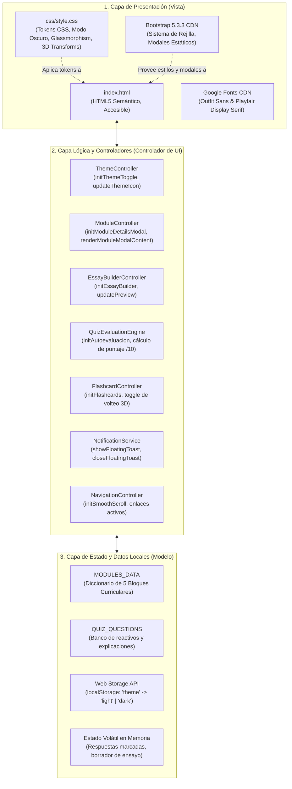
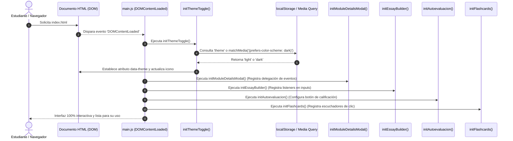
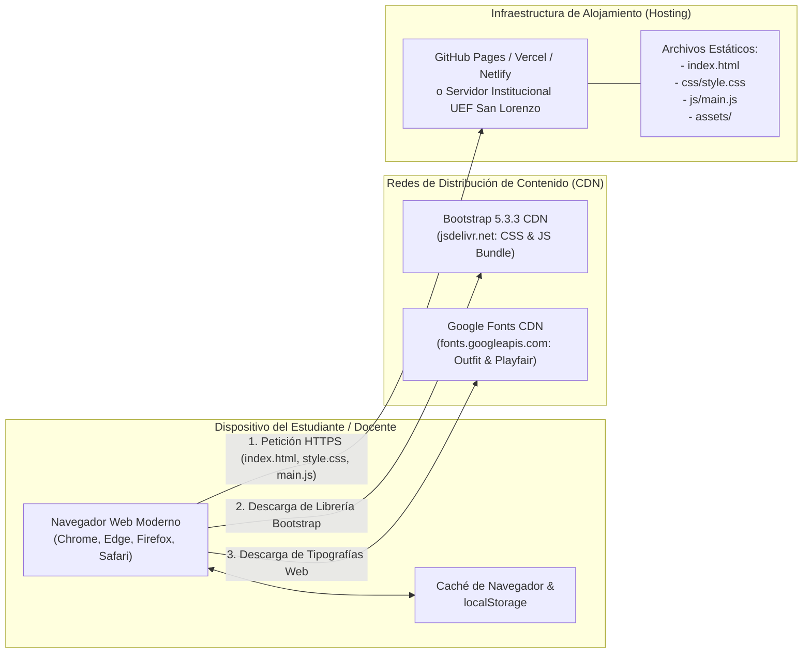

# 🏛️ Arquitectura del Proyecto: Lengua y Literatura 9.º EGB

Este documento describe la arquitectura técnica, los principios de diseño, el modelo de capas, los flujos de datos y la estrategia de despliegue de la plataforma educativa interactiva de **Lengua y Literatura (9.º Año de Educación General Básica Superior)** de la **Unidad Educativa Fiscomisional San Lorenzo**.

---

## 1. Visión General y Estilo Arquitectónico

La plataforma adopta el patrón arquitectónico de **Aplicación Web Estática de Página Única Ligera (Client-Side Static SPA / JAMstack Frontend)** complementada con una **Arquitectura Basada en Eventos y Componentes Desacoplados en Vanilla JavaScript (Event-Driven UI Pattern)**.

### Características del Enfoque Arquitectónico
- **Zero-Build Overhead:** La aplicación se ejecuta de forma nativa en cualquier navegador web moderno sin requerir empaquetadores complejos (Webpack, Vite) ni procesos de transpilación previa. Esto garantiza que cualquier estudiante o docente pueda ejecutar el proyecto sin barreras técnicas.
- **Bajo Consumo de Recursos:** Ideal para entornos escolares o dispositivos con hardware modesto o conexiones a Internet intermitentes.
- **Separación de Intereses (SoC):**
  - **Estructura Semántica:** HTML5 con etiquetas canónicas para SEO educativo y accesibilidad.
  - **Diseño y Estilizado:** CSS3 Vanilla modularizado con tokens de diseño en variables raíz (`:root` y `[data-theme="dark"]`).
  - **Comportamiento Reactivo y Datos:** JavaScript ES6+ que gestiona la lógica, el almacenamiento local y la inyección dinámica de contenidos.

---

## 2. Modelo Arquitectónico de Capas

El software se organiza conceptualmente en tres capas lógicas bien definidas:

### Detalle de cada Capa:

#### 1. Capa de Presentación (UI / Vista)
- **Documento Semántico (`index.html`):** Define el árbol DOM jerárquico estructurado en secciones temáticas (`#inicio`, `#modulos`, `#lecciones`, `#taller`, `#figuras`, `#cuestionario`).
- **Sistema de Diseño (`css/style.css`):**
  - Implementa una arquitectura basada en variables CSS (`--primary`, `--secondary`, `--bg-body`, `--text-main`, etc.).
  - Soporta el conmutador de tema claro/oscuro de forma inmediata modificando el atributo `data-theme` en la etiqueta `<html>`.
  - Contiene utilidades visuales modernas: tarjetas elevadas, gradientes sutiles, microanimaciones y efectos 3D para el aprendizaje interactivo.
- **Framework de Soporte (Bootstrap 5.3.3):** Provee el sistema de diseño responsivo de doce columnas y la API de modales para las tres lecciones formativas del nivel.

#### 2. Capa Lógica y Controladores (`js/main.js`)
Esta capa orquesta las interacciones del usuario y responde a eventos del DOM:
- **`ThemeController`:** Detecta las preferencias del sistema operativo (`prefers-color-scheme`), lee la preferencia del usuario desde `localStorage`, aplica el tema y sincroniza los iconos visuales (🌙 / ☀️).
- **`ModuleController`:** Escucha clics en los botones `.js-open-module`, consulta la estructura de datos del módulo respectivo y construye dinámicamente el contenido HTML en la ventana modal centralizada.
- **`EssayBuilderController`:** Escucha eventos `input` en los campos de tema, tesis y argumento, proyectando en tiempo real una tarjeta de previsualización estructurada.
- **`QuizEvaluationEngine`:** Valida que el estudiante haya respondido las 3 preguntas del cuestionario de 9.º EGB, calcula la calificación cuantitativa en escala de 0 a 10.0 puntos y genera retroalimentación cualitativa inmediata.
- **`NotificationService`:** Administra el ciclo de vida del *Toast flotante* interactivo, asegurando que solo exista un mensaje visible y permitiendo el cierre manual o reactivo.
- **`FlashcardController`:** Gestiona el volteo tridimensional de las tarjetas didácticas alternando la clase CSS `.flipped`.

#### 3. Capa de Estado y Datos Locales (Modelo)
- **Estructuras en Memoria:**
  - `MODULES_DATA`: Colección estructurada que almacena los 5 bloques del currículo nacional (título, insignia, descripción, lista de temas principales y desglose conceptual).
  - `QUIZ_QUESTIONS`: Banco de preguntas con opciones de respuesta, índice de acierto y retroalimentación pedagógica.
- **Persistencia en Cliente:**
  - `localStorage`: Guarda la clave `'theme'` para mantener la preferencia visual entre sesiones y recargas de página.

---

## 3. Ciclo de Vida y Flujo de Inicialización

Al cargar el documento en el navegador, el sistema sigue una secuencia ordenada de inicialización sin bloqueo del renderizado principal:

---

## 4. Diagrama de Despliegue e Infraestructura

Dado que el proyecto no requiere un servidor de aplicaciones dinámico (como Node.js, PHP o Python en producción), puede desplegarse en cualquier infraestructura de **Alojamiento Web Estático**:

### Ventajas de este Modelo de Despliegue
1. **Costo Cero de Mantenimiento:** Puede alojarse gratuitamente en GitHub Pages, GitLab Pages, Cloudflare Pages, Netlify o Vercel.
2. **Alta Disponibilidad y Tolerancia a Fallos:** Los servidores de páginas estáticas tienen una disponibilidad superior al 99.99% y entregan contenido con tiempos de latencia mínimos gracias al edge caching.
3. **Seguridad Robusta:** No hay vulnerabilidades asociadas a ejecución de scripts en backend (como inyección SQL o Remote Code Execution en servidor).

---

## 5. Principios de Diseño y Atributos de Calidad

### A. Rendimiento (Performance)
- **Cero Dependencias Pesadas:** No utiliza frameworks reactivos que requieran descargar megabytes de runtime (como React o Angular). La carga inicial se completa en menos de **300 milisegundos**.
- **Estilos Eficientes:** Uso de selectores CSS de baja especificidad y transformaciones basadas en aceleración por hardware (`transform`, `opacity`) para transiciones fluidas a 60 FPS.

### B. Accesibilidad (A11y)
- **Contraste de Color:** La paleta de colores (`--primary: #4f46e5`, `--text-main: #0f172a` en claro y `--text-main: #f1f5f9` en oscuro) cumple con los requisitos de contraste mínimo WCAG 2.1 AA.
- **Soporte de Entrada:** Elementos interactivos con atributos accesibles (`aria-label`, `aria-labelledby`, `role="dialog"` y controles con etiquetas `<label for="...">`).

### C. Mantenibilidad y Extensibilidad
- **Arquitectura Basada en Datos:** Para modificar los contenidos de los bloques curriculares o actualizar el cuestionario de preguntas, basta con editar los objetos `MODULES_DATA` y `QUIZ_QUESTIONS` en `js/main.js` sin alterar las funciones lógicas ni la estructura HTML.
- **Diseño Modular:** Cada funcionalidad tiene una función inicializadora independiente (`initThemeToggle`, `initModuleDetailsModal`, `initEssayBuilder`, etc.), lo que permite agregar nuevos módulos fácilmente.
