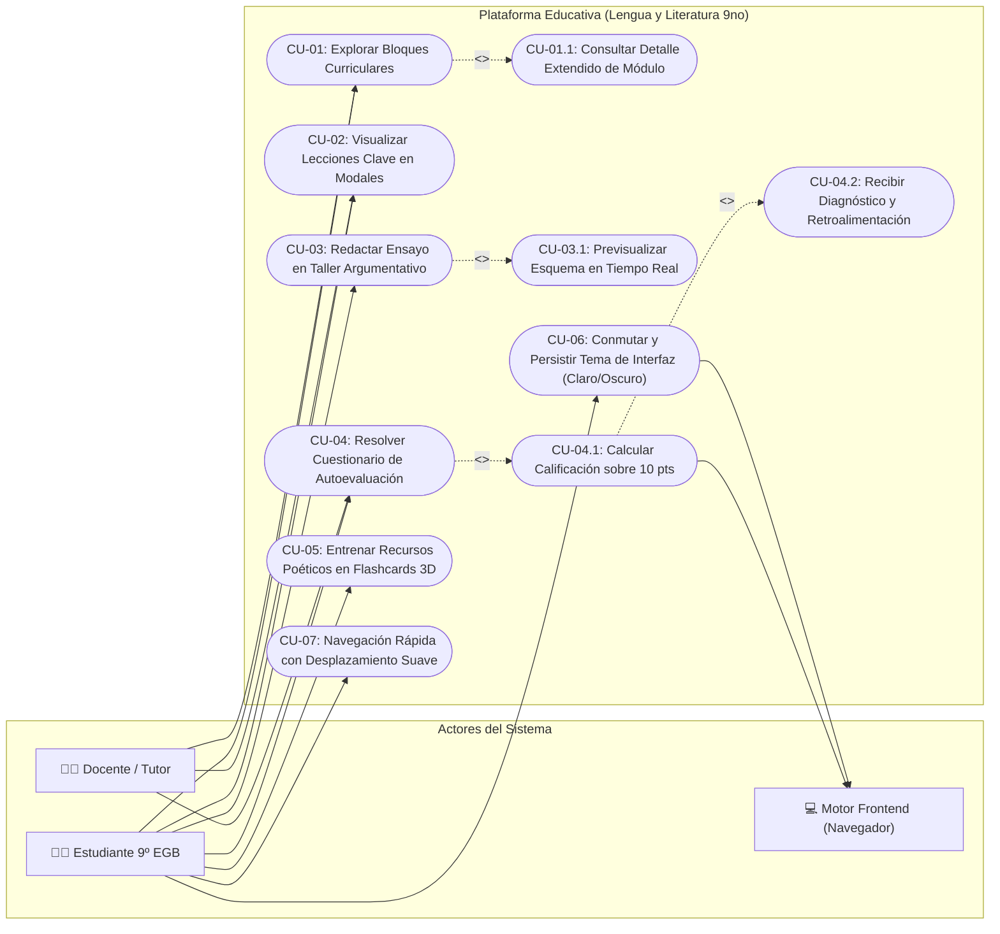
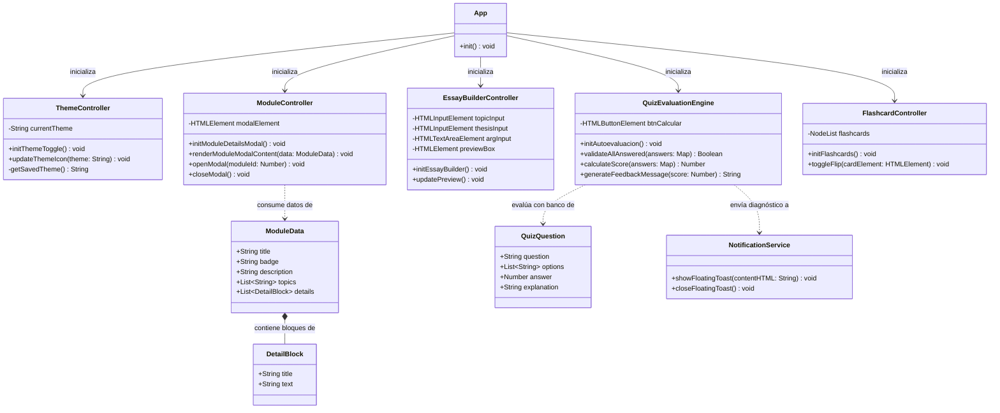
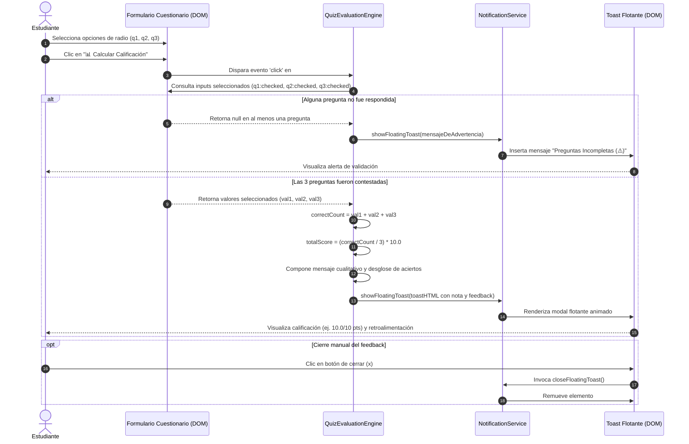
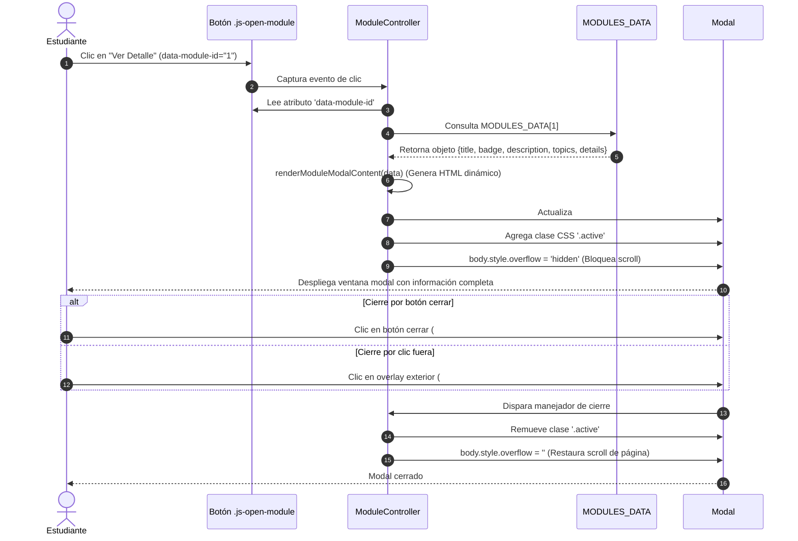
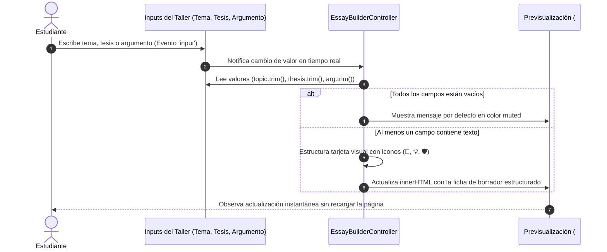
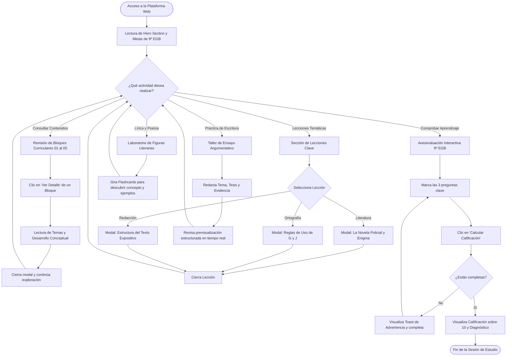

# 📐 Diagramas UML del Proyecto: Lengua y Literatura 9.º EGB

Este documento contiene la especificación y el modelado formal del sistema mediante el Lenguaje Unificado de Modelado (**UML**), representado a través de diagramas en sintaxis estándar de **Mermaid**.

---

## 1. Diagrama de Casos de Uso

Representa los actores principales del ecosistema y sus interacciones con las capacidades funcionales de la plataforma web.



---

## 2. Diagrama de Clases y Estructuras de Datos

Modela la organización orientada a objetos y estructuras modulares presentes en la capa lógica (`js/main.js`), sus propiedades, métodos y relaciones de dependencia.



---

## 3. Diagramas de Secuencia

### 3.1 Flujo de Autoevaluación Interactiva y Cálculo de Calificación
Describe la interacción desde que el alumno selecciona las opciones del cuestionario hasta la presentación del resultado flotante.



---

### 3.2 Consulta Dinámica de Detalle de Módulo Curricular
Ilustra el proceso de extracción de datos del bloque y su inyección en la ventana modal personalizada.



---

### 3.3 Redacción Reactiva en el Taller de Ensayo Argumentativo
Muestra la respuesta inmediata a la pulsación de teclas durante la construcción de la tesis y argumentos.



---

## 4. Diagramas de Estados (State Machine)

### 4.1 Ciclo de Vida del Tema Visual (Dark / Light Mode)
Modela las transiciones del tema de acuerdo con las acciones del usuario y las preferencias del navegador.

```mermaid
stateDiagram-v2
    [*] --> DeteccionInicial : Carga de la página (DOMContentLoaded)

    state DeteccionInicial {
        [*] --> VerificarLocalStorage
        VerificarLocalStorage --> TemaAlmacenado : 'theme' existe en localStorage
        VerificarLocalStorage --> ConsultarSistema : 'theme' no definido
        ConsultarSistema --> ModoOscuro : prefers-color-scheme es dark
        ConsultarSistema --> ModoClaro : prefers-color-scheme es light
        TemaAlmacenado --> ModoOscuro : Valor es 'dark'
        TemaAlmacenado --> ModoClaro : Valor es 'light'
    }

    DeteccionInicial --> ModoClaroActivo : Aplica data-theme="light"
    DeteccionInicial --> ModoOscuroActivo : Aplica data-theme="dark"

    state ModoClaroActivo {
        ModoClaroActivo : data-theme="light"
        ModoClaroActivo : Icono del botón = "🌙"
        ModoClaroActivo : Variables claras aplicadas
    }

    state ModoOscuroActivo {
        ModoOscuroActivo : data-theme="dark"
        ModoOscuroActivo : Icono del botón = "☀️"
        ModoOscuroActivo : Variables oscuras aplicadas
    }

    ModoClaroActivo --> ModoOscuroActivo : Clic en #theme-toggle / Guarda en localStorage
    ModoOscuroActivo --> ModoClaroActivo : Clic en #theme-toggle / Guarda en localStorage
```

---

### 4.2 Estados del Motor de Autoevaluación
Modela el estado del cuestionario formativo.

```mermaid
stateDiagram-v2
    [*] --> NoIniciado : Carga del Formulario

    state NoIniciado {
        NoIniciado : Sin opciones seleccionadas
        NoIniciado : Sin resultado visible
    }

    NoIniciado --> EnProgreso : Estudiante marca alguna respuesta
    
    state EnProgreso {
        EnProgreso : Respuestas parciales registradas
    }

    EnProgreso --> Validando : Clic en "📊 Calcular Calificación"

    state Validando <<choice>>
    Validando --> ErrorIncompleto : Faltan preguntas por contestar
    Validando --> Evaluado : Las 3 preguntas respondidas

    state ErrorIncompleto {
        ErrorIncompleto : Muestra toast de advertencia ⚠️
    }

    ErrorIncompleto --> EnProgreso : El estudiante completa preguntas faltantes

    state Evaluado {
        [*] --> DesgloseResultado
        DesgloseResultado --> NivelExcelente : 3 aciertos (10.0 pts)
        DesgloseResultado --> NivelBueno : 2 aciertos (6.7 pts)
        DesgloseResultado --> NivelRefuerzo : 0 o 1 acierto (<= 3.3 pts)
    }

    Evaluado --> EnProgreso : El estudiante modifica una respuesta
```

---

## 5. Diagrama de Actividades / Recorrido Pedagógico del Estudiante

Muestra el flujo de navegación y aprendizaje que sigue un estudiante de 9.º EGB en la plataforma.



---

## 6. Diagrama de Componentes de Software

Muestra la integración de módulos lógicos internos con las librerías del cliente:

```mermaid
componentDiagram
    package "Plataforma Web (Lengua-Literatura-9no)" {
        [index.html] as HTML
        [css/style.css] as CSS
        [js/main.js] as JS

        folder "Módulos Lógicos en main.js" {
            [ThemeManager] as TM
            [ModuleManager] as MM
            [EssayBuilder] as EB
            [QuizEngine] as QE
            [Flashcards] as FC
            [ToastNotification] as TN
        }
    }

    cloud "Servicios en la Nube / CDN" {
        [Bootstrap 5.3.3 CSS & JS Bundle] as BS_CDN
        [Google Fonts: Outfit & Playfair Display] as GF_CDN
    }

    HTML --> CSS : Vincula estilos
    HTML --> JS : Ejecuta script principal
    HTML ..> BS_CDN : Carga estilos y componentes modales
    CSS ..> GF_CDN : Importa familias tipográficas
    
    JS *-- TM
    JS *-- MM
    JS *-- EB
    JS *-- QE
    JS *-- FC
    JS *-- TN
```
